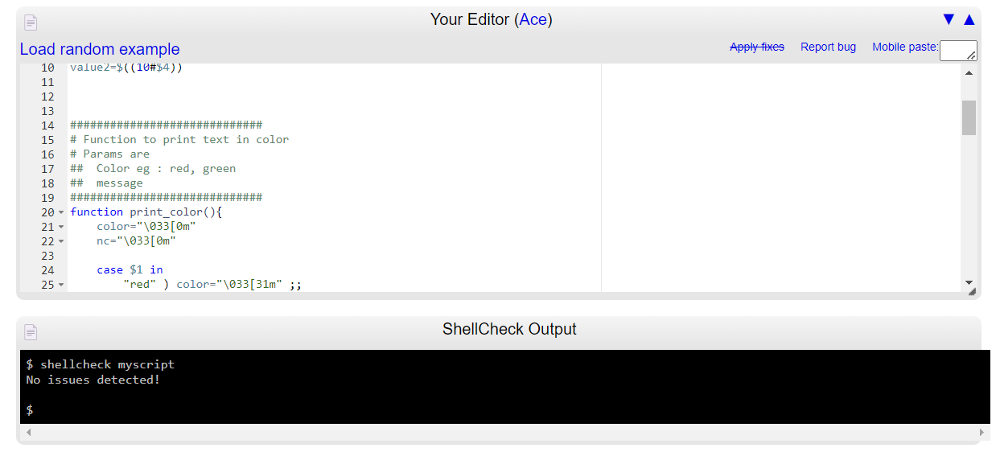

# Password Generator

This is a bash script to generate random passwords.

## Usage

**Make the script executable**

Before using the script, ensure that it is executable. You can do this using the `chmod` command.

```bash
chmod +x password_generator.sh
```

This command grants execute permission to the script file password_generator.sh.

**Run the script**

To generate passwords, run the script with appropriate options:

```bash
./password_generator.sh --length <length> --count <count>
```

Replace <length> with the desired length of each password and <count> with the number of passwords to generate.

Example:

```bash
./password_generator.sh --length 12 --count 5
```

## Shellcheck Validation

[](https://github.com/koalaman/shellcheck)

_Shellcheck is a powerful tool used to validate shell scripts for issues or defects. It helps ensure that your scripts follow best practices and are free from common errors._
