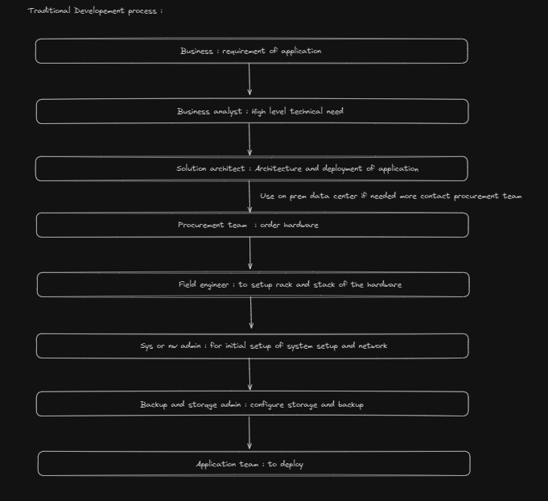
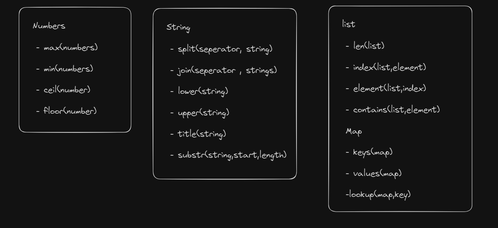
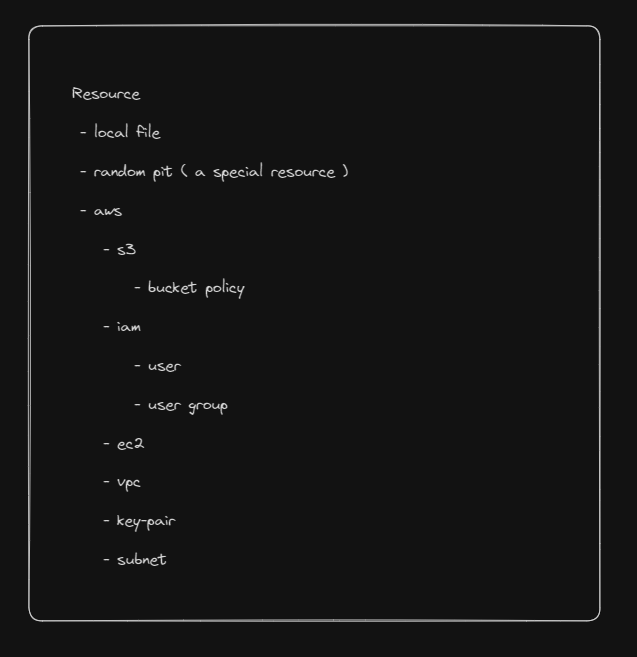

## Workflow



**These workflow issues have numerous drawbacks**:

1. Take lot of time for setup as there are lot of team involved

2. More expensive

3. Wasted resource inability to scale resource based on need

4. Limited automation

5. Human error (lot of teams) -> inconsistent

**Here comes the cloud provider and removed**:

1. Take lot of time for setup as there are lot of team involved

2. More expensive

3. Wasted resource inability to scale resource based on need

4. Limited automation

But there are still human errors because we need to configure every resource for an infrastructure through console management UI in the cloud, and it needs to be done across various teams (5. Human error (lot of teams) -> inconsistent).

To overcome this, organizations start to write scripts in shell, Python, leveraging the use of provider APIs to spawn resources. However, maintaining these scripts becomes complex.

We can see the organization write code to provision or make a infra thus Infrastructure as Code

## IAC Tool

There are broadly three types of IAC tool (tool to write code for infra):

1. **Config management Tool**: Ansible, Puppet

   - Used for managing software and dependencies in resource

   - Well-structured than shell script, idempotent (code change will update existing resource not create a new one)

2. **Server templating Tool**: Docker, Vagrant

   - Pre-installed OS or software as an image (osboxes.org)

   - Basically for setting a server or software in the resources

   - Immutable (on every update need to create a new one)

3. **Provisioning Tool**: CloudFormation (AWS), Terraform (Any platform)

   - Used to provision resources or infra as immutable

   - Support a lot of providers

IAC like terraform are declarative language that is we need to say what to do it will internally calculated how to do it

## Terraform:

- Open-source IAC tool

- Easy binary setup

- Supports a lot of providers by leveraging their API

- HCL (HashiCorp Configuration Language): infra code language

- `.tf` is the file extension

- Code represents the desired state that we want our target environment to be in

- Terraform performs actions in three steps:

  - `init`: Initial setup and identifying the provider

  - `plan`: Makes an execution plan by creating a list of all resources needed

  - `apply`: Executes the plan (Terraform brings the state of resources back to the desired state)

- Terraform can identify external resources through data sources for use in creating plans

- Terraform can import external resources under its control

## Terraform Installation:

- Downloading exe or binaries as zip

- Moving them to the system and running Terraform command

**HCL**:

**Syntax**:

```hcl
<block> <argument> {
    arguments....
}
```

**Block** is a piece of code that contains information about a resource or object that we want Terraform to create.

**Example**:

```hcl
<resource> <provider_resourceType resource_name> {
    key = value
    //arguments....
}
```

terraform Init : to create a working directory with config file with identification of provider and download plugin for it

terraform plan : to create a plan which output like a git diff where + to create - to modify resource and configuration

terraform apply : to actual execute the plan

terraform destroy : to destroy resources

for Updation : Edit the file and update it using apply command

## Terraform Provider:

- There are a lot of providers that Terraform supports.

- Terraform achieves this by using a plugin architecture. When we run the `init` command, it will download the plugin from its public registry, `registry.terraform.io`.

- There are three types of providers:

  - Official: Owned and maintained by HashiCorp.

  - Partner: Maintained by third-party companies by partnering with Terraform.

  - Community: Result of individual contributions and maintained by the HashiCorp community.

- These providers and plugins are distributed by Terraform in a public registry.

- The `init` command is safe to execute; it will not cause any damage to the underlying infrastructure.

- When we run `init`, it will download plugins from a URL. If the registry is `registry.terraform.io`, then it is omitted.

- These plugins get updated to new versions, and Terraform will take the latest version by default. To stick to one version, we can use a lock file created to keep track of versions.

- The downloaded plugins are placed in the `.terraform` directory.

- We can have as many `.tf` files in a configuration directory. Terraform will consider all of them, but it is a good practice to have a single file with all config blocks named `main.tf`.

- Similarly, we can have `variables.tf`, `outputs.tf`, and a provider file for respective configurations.

## Multiple Providers

- We can create multiple resources with multiple providers inside a `.tf` file by declaring them as blocks.

- Terraform's `init`, `plan`, and `apply` commands will use the existing resources while creating, like downloading plugins, etc.

- Terraform variables are used to remove hardcoded values for arguments inside a block. If we do not use variables, the main aim of reusability in Infrastructure as Code (IAC) gets affected.

- We need to declare variables as blocks inside a separate file named `variables.tf`.

- We need to use them as `var.variable-name`. It is advisable to use the variable name as the argument name.

- Terraform's lifecycle remains the same.

- Terraform variable blocks have three properties:

  - `default`: value
  - `description`: describe the variable

  - `type`:

    - any (default)
    - number

    - string
    - boolean

    - list: `list(number)`, `list(string)` etc.

    - set: `set(number)` etc. - list without duplicates
    - map: `map(string)` the data type within the brackets determines the value of the key in the map

    - object: we can declare complex user data types within it

    - tuples: list with a predefined size and data type for each element

- If the mentioned type is not given as a value via default, then an error will be thrown.

- `default`, `type`, and `description` are optional, but it is good to use them.

## Variable Assignment

- We know `default` is an optional argument.

- We can assign a value using a lot of ways.

- If not assigned using any method, it will open in an interactive mode and ask for a value.

- We can use an environment variable like `TF_VAR_variable-name="value"`.

- We can use `terraform.tfvars` or `*.autos.tfvars` or `terraform.tfvars.json` or `*.autos.tfvars.json`, which will be loaded when using `terraform apply`. In this file, we declare the variable name using HCL without a block.

- We can give the variable name using `-var "name:value"`. We can use it multiple times or with different variables in the `terraform` run command.

- We can create a file with any name with an extension ".tfvars" and assign it using `-var-file`.

- If we declare it more than twice, Terraform will start and end in resolving in the order mentioned above. The lowest in the list has the top priority.

- The order is environment variable > command line > config file > tfvars or autos.tfvars or autos.tfvars.json file.

- If we are using methods other than the config file, there's no need for a variable block.

- Linking multiple resources using resource attributes.

- We can give the output of one resource into another through resource attributes. We can see the attributes in the documentation.

- We can use that with interpolation in the getting resource `${resource.resource-name.attributes}` or directly.

- `terraform plan`: to output a plan in a human-readable format.

- We have ways to link resources as discussed using reference links or attributes.

- Based on this, Terraform will execute the block and revert it in the reverse order.

- We can explicitly create the order by using the `depends_on` array.

## Output Variable:

- Used to hold the value of an expression.

- We can print the output using `terraform output` or `terraform output <variable-name>`.

- It is mostly used in providing values to other Infrastructure as Code (IAC) tools as between resources, we have a reference expression.

## Terraform State:

- Whenever we run `terraform plan` or `apply`, Terraform will reconcile (find the difference between the current state of the infrastructure and the current state file info) and compare it with what we need after applying the changes.

- After applying the generated plan, it will create or update a state file with an extension ".tfstate" with all metadata and details.

- Purpose of this state file:

  - The state file records the dependencies between the resources (explicit and implicit) to help while creating or updating.

  - Whenever we update and apply Terraform, it will delete and create new resources and update the state file with newly created resource IDs.

  - We can skip Terraform skipping the initial reconcile by `--refresh=false`. Now Terraform knows not to refresh state or reconcile info, just make use of the state file. This leads to saving time and improving performance in the real world.

  - When working with a team to maintain consistency, we can put this state file in a remote location, and all team members can make use of it.

  - It's not recommended to store in GitHub as it doesn't have concurrency and lock mechanism:

    - Lock mechanism allows only one developer to make changes at a time.

    - Concurrency allows which one to execute first while working as a team.

    - Storage for tfstate file are Terraform Cloud.

When working with state file we need to know it may contain sensitive info like IP of VM, ssh key, passowrd of database

- We need to store the file in backend system like s3 when working as a team because storing in local leave senstive data

- we can store the config file ".tf" in github repo

- if we need to make changes in .tf file we need to make the changes via terraform state command

- `terraform validate`: Used to check whether the config file syntax is correct without the need to apply or plan it, only syntax and no logical.

- `terraform fmt` or `format`: Used to make the file into a more readable format (canonical form).

- `terraform refresh`: Used to refresh the state (actual infra and update the tfstate file).

- `terraform output` or `terraform output variable name`: Used to print output variable.

- `terraform graph`: Used to visualize the dependency between resources using software called Graphviz.

- `terraform show`: Info about the resource created (`-JSON` flag to output in JSON format).

- `terraform mirror <dist-folder>`: To copy provider plugin to a new area.

- `terraform providers`: To list all provider info.

**Mutable Infra:**

- Consider three different servers with different configs running a particular version of Nginx for our web application.

- We need to move to the latest version of Nginx.

- We can do this by using a software management IAC tool like Ansible.

- Because of different configs in each software, there is configuration drift which results in inconsistent infra like updating two or one server but not the other, making it harder to understand or debug the state.

**Immutable Infra:**

- Here, a new server with the latest Nginx is provisioned, and older ones are deleted. If some failed, still, old servers are there.

- In general, Terraform deletes and creates resources. If we need to change that, we need to understand lifecycle rules.

**Lifecycle Rule:**

- `create_before_destroy`

- `prevent_destroy`: To prevent resource deletion by Terraform apply in the case of a DB service, but Terraform destroy can delete it.

- `ignore_changes`: The array has all the arguments that need to be ignored while Terraform plan and apply.

- `create_before_destroy`: If unable to create a new one like a unique constraint in the filename, then it won't create but delete the existing file.

## Data Block

- Data block is also like a resource block that helps us to read infra which is not under the control of Terraform and use it for other resources or execution plans.

- Data resource can be stored in an object called data in Terraform.

- Data block also has arguments and attributes.

**Meta Arguments: Special Attributes**

- It helps to create multiple instances of the same.

- `depends_on`, `lifecycle`, `count`.

- `count`: Used to create multiple instances of a resource by making the resource block as a list. We can create a variable to hold the filename which is a unique constraint; otherwise, Terraform will delete and create the same file forever.

- We can access the list element using `count.index` which points to multiple instances starting from 0 to count-1.

- If we change it, then it will lead to modifying the field, and the position of the element changes, so changes will occur for all elements.

- Like removing an element leads to destroy and updating all elements.

- In case of `count`, the multiple instances are stored as a list. Changes or updates in the list result in multiple destroy and creation.

- To overcome this, we use `foreach` which will accept input variable as set or map (we can use set to make a list as a set). It will store multiple instances as a key-value map (key as what we give), so it can track the key and make only necessary updates.

- We can use a particular version of a provider by using a Terraform resource with required provider plugin arguments.

- We can use comparison operations like `<`, `>`, `!=` when declaring the version within quotation.

- We can also use the pessimistic operator `~>` version. It will only change the last digit of the version to the latest possible (minor and patch).

## AWS provider

- Terraform provides a dedicated provider for AWS to provision infrastructure using AWS services. (Terraform is an advanced tier partner for AWS).

- IAM (Identity and Access Management) user, IAM Group, IAM Role (between services, from different AWS accounts, users from outside AWS).

- IAM offers a lot of pre-built policies and we can also create custom ones.

- We can allow IAM users to log in two ways (username/email and password) through console management web.

- We can also access using CLI (programmatically) using access key ID and access private key.

- Programmatic access involves installing AWS CLI.

- `aws configure` is used to set the access key ID and access secret key.

- `aws <command> <subcommand> <options and parameters>`: Command specifies a service, and subcommand specifies the operation on the service.

- `help` command is used to see the documentation at any level like command, subcommand, etc.

- Configuration and credentials are stored under the `.aws` folder in the home directory.

- AWS with Terraform will give us a lot of resources to provision a service, but we need to set AWS configuration like region, access key as we access through CLI.

- We can use a provider block like a resource block with the provider name and other details as arguments.

- The above step is not good as we expose the credentials.

- So we can configure the credentials in AWS CLI and run Terraform from there with a provider block only having region details.

- We can put all the values as an environment variable like `AWS_REGION`, and Terraform itself will take it when needed.

- While creating or assigning a policy, we need to use JSON for creating the policy.

- Since JSON is multiline, to give it as a value to the policy argument, we can do it in two ways:

  - Here-doc: a popular way to provide multiline value to arguments:
    ```shell
    <<EOF
        {{Entire JSON}}
    EOF
    ```
  - Using the file function: we can store the JSON as a separate file and access it in the config file using the `file(<file_name>)` method.

- AWS S3 is used to store files or objects.

- Each bucket name should be unique so that a DNS name will be allocated as `www.<dns-name>.<region>.awsamazon.com`.

- Each folder and file is identified as an object by appending as a suffix in the main bucket URL.

- We can create an S3 bucket with Terraform and attach a bucket policy with IAM group or IAM users ARN.

- AWS DynamoDB is a NoSQL database with high availability and low latency.

- DynamoDB helps us to store data as a document with key and value pairs.

- Each document is called an item.

- We know to collaborate with other people in Terraform we can use GitHub to store the config file but not the state file.

- As the state file updates each time we run the config file, it will result in errors or inconsistency when two people run at a time.

- Terraform allows a single run at a time for a config file by providing a lock mechanism (check running two times `terraform apply` simultaneously in local, Terraform takes care of the lock mechanism).

- We can create such a mechanism in S3, Azure, Terraform Cloud, etc.

- In the case of S3, we need to create a DynamoDB with LockId as the primary key for the lock mechanism.

- We need to set up a Terraform block with backend arguments with all the values like S3 bucket name, file name, DynamoDB, and region.

- We know `tfstate` stores sensitive info, so S3 and supported backends allow us to store it in an encrypted way.

- It is not good practice to manually update the Terraform state file.

- Instead, we need to use Terraform state command with subcommands like list, rm, mv, pull, show.

- `terraform state list <name>`: to list all matching resource names.

- `terraform state mv <src> <dist>`: if src and dist are the same then renaming or actually moving from one file to another.

- `terraform state show`: to get detail of resource if specified name or entire state.

- `terraform rm <resource_name>`: will remove from tf state but not destroy actual infra resource we need to do it manually.

- If we make changes to tf state, remember to update the config file to sync the changes.

- We need to use `terraform pull` command if we use remote state file and use jq-like tools to have JSON filter.

- EC2 in Amazon: a scalable compute with various OS or AMI image options (which has OS and software as templates).

  - Note: AMI IDs are specific to regions.

- EC2 is categorized as instance types based on the CPU, memory, and network specs.

  - Most common type is T2 general purpose which has a lot of EC2s based on memory and RAM (similarly we have T3, T5, M5 based on CPU, memory, GPU, etc.).

- We can install or do some configuration while launching by giving scripts in user data.

- EC2 instance with Terraform:
  - AMI ID
  - Instance types
  - Key-value pair for SSH (we need to create a separate resource and reference it in `key_name`).
  - Similarly for VPC, subnet, and network security and reference it.
  - We can get the IP by outputting the IP as an output variable.
  - We can give user data using heredoc (`<<<EOF  EOF`).

## Provisioners

Provisioners block helps to run a script after a resource is created or destroyed, either in remote or local.

- Like installing software in EC2 remote.
- Logging to a local file after a resource is destroyed.
- When we run some command in `remote_exec` that is remote resource, we need to configure the connection block with all details like private key, hostname, IP in case of SSH connection.
- When an error is encountered in the provisioned block, Terraform will stop working to avoid that; we can specify the `on_failure` argument to continue or fail to stop.
- To specify whether it is a create time or destroy time provisioner, we need to specify `when` arguments.

- Provisioners, if failed and the argument `on_failures = fail`, put the resource in a taint state.

- User data only runs on the first boot.

- It is always recommended to use native provisioners.

- In the case of Terraform provisioners, Terraform state can't hold the action of a command we run in the resource.

- We need to have an internet connection and authentication in case of remote execution.

- We can also create custom templates, i.e., new AMI images, and run them.

- **Terraform Taint:**

  - If a resource creation has multiple steps and encounters an error in a step after creation, Terraform feels that the state is undesired and puts it in a taint mode.
  - If we manually update some resource like updating the version of software, we can manually put a resource in a taint state.
  - Taint tells Terraform that it needs to take care of recreating the resource next time when applying changes.
  - Untaint tells Terraform not to recreate the resource on the next apply.

- **Terraform Log:**

  - By setting `TF_LOG = Trace` or any log level, Terraform displays detailed logs of what really happened.
  - By setting the `TF_LOG_PATH`, Terraform outputs the log to a file.

- Terraform data sources help us to retrieve attributes and metadata from a resource which is not under the control of Terraform, but we don't have control to update or delete it.

- To manage an external resource with Terraform, we need to import it using the command: `terraform import <resource-type>.<resource-name> attributes`

- As Terraform only updates the state file and not the config file, we need to create an empty resource block for it before running the command. After a successful import, we need to update the config file based on the state file or resource info.

## Terraform Modules:

- As resource requirements increase, the Terraform file also increases, resulting in increased complexity.

- To overcome this, we can split the file into multiple files, as all files with ".tf" will be taken into account by Terraform. However, this approach is still not reusable and increases the risk of updates.

- The best way to manage this is by using modules. We can create separate directories for each resource, and then use the files in another directory using the module block with the source attribute as the relative path.

- Use cases of modules include creating infrastructure for one region and exporting it to another module, allowing us to assign variables from there and use them in multiple regions.

## Function in Terrafrom

- We can also utilize modules from the Terraform registry, which are provided by either the provider or the community. There are numerous modules available for different providers. If there is a checkmark next to a module, it signifies that it has been verified by Terraform.

- Modules from both public and private registries can be used by specifying the provider link to the registry. However, if the module is from HashiCorp, there's no need to mention the link.

- Terraform provides several input functions that can be used within the configuration file. However, these functions are often used without being tested. To test these functions, we can utilize the Terraform console, where Terraform loads all variables and state files, allowing us to test the functions.

- Some common functions include:

<!-- Image -->



- In Terraform, we can utilize arithmetic, conditional, and logical operators to control the flow of execution. Ternary operators can be used instead of traditional if-else statements since Terraform does not support if-else constructs.

- Expressions and flow control can be tested in the Terraform console.

## Terraform Workspaces:

- When there's a need to create multiple instances of the same type, we can copy and paste the configuration code into different directories and follow the Terraform commands.

- Alternatively, we can use modules to avoid duplicating code by creating separate directories and defining resources within modules.

- If we need to create copies of resources with minor configurations such as different environments like QA, dev, etc., Terraform workspaces offer a better solution.

- Terraform workspaces create new environments or branches similar to Git. We can run `terraform apply` to set up resources for the workspace configuration. Switching to another workspace allows us to create the same resources with different configurations.

- Commands for managing workspaces:

  - `terraform workspace new <workspace-name>`: Creates a new workspace.
  - `terraform workspace select <workspace-name>`: Switches between workspaces.
  - `terraform workspace list`: Lists all workspaces.

- We can set default values for variables as a map, with the workspace name as the key and the configuration as the value. During execution, we can lookup the configuration based on the current workspace using `terraform.workspace`.

- Terraform modules can be utilized to create separate modules for different components such as databases, web servers, etc.

- Terraform workspaces enable the creation of the same infrastructure for different environments such as development, QA, staging, etc. By default, Terraform works in a workspace named "default".

**Note:** When using Terraform workspaces, state files for each workspace are created under a directory with the workspace's name for which the `apply` command is run.

# Resource Learned


