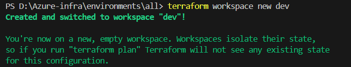
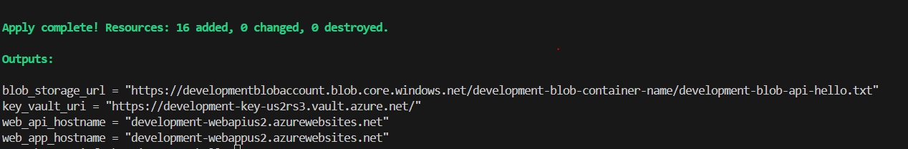
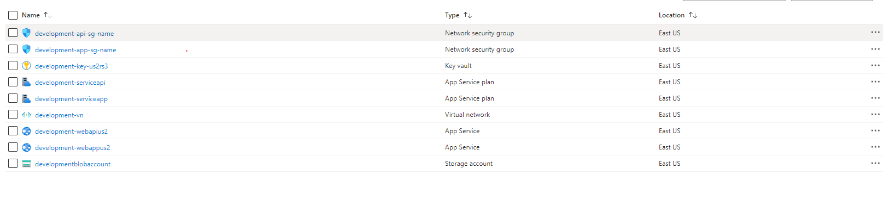

# Azure Infrastructure as Code

The terraform file contains the code for the below infrastructure diagram

### Prerequisites:

1.  Terraform.

1.  Azure ClI (optional).
1.  Azure Subscription.

## Deployment Instructions

1. Replace the [subscription_id](./Azure-infra/environments/all/provider.tf#1)

```hcl
provider "azurerm" {
  features {}
  subscription_id = "replace here"
}
```

2. Replace the [Resource group name](./global/data-source.tf#1)

```HCL
variable "azurerm_resource_group_name" {
    default = ""
    description = "The variable hold the common resource group from azure kodekloud"
}
```

3. Run `terraform init`

4. Run `terraform plan`

5. Run `terraform apply`

6. create seperate workspace using `terraform workspace new *work-space-name*`

```hcl
workspace_config = {
  "dev"     = "development"
  "qa"      = "aqassu"
  "prod"    = "production"
  "stage"   = "stage"
  "default" = "development"
}
```

7. Repeat the step 3,4,5

8. to switch between different workspace use `terraform workspace select *work-space-name*`

## Output for workspace dev

**Terraform workspace**



**Terraform apply**



**Azure console**


